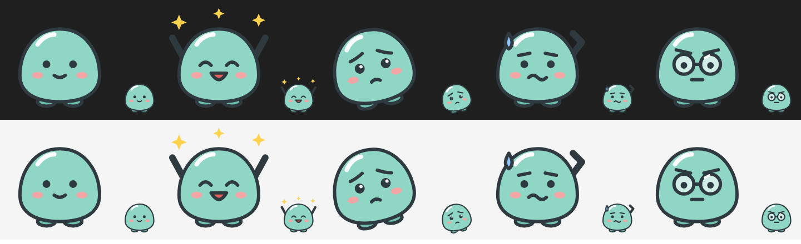

# claude-desktop-pet

Claude Desktop の Code タブで、入力欄の上に好きなキャラと吹き出しを出す Claude Code の mod です。Claude の返答の最後のひとことを吹き出しに出し、作業中や返答の中身に合わせて表情を切り替えます。

Anthropic の公式ツールではありません。



## できること

- 入力欄の上の帯に、キャラの絵と吹き出しを出す
- 作業中は作業用の表情にして、吹き出しに「書いてます…」「調べてます…」など、使っているツールに合わせたひとことを出す
- 返答が終わったら、最後の段落を吹き出しに出し、その中の言葉で表情を選ぶ
- ターミナル版の Claude Code では絵を描けないので、名前とひとことだけを出す

キャラの名前、色、ひとこと、表情を決める言葉、絵は、すべて `characters/<キャラ>/` にまとまっています。mod 本体を触らずに、自分のキャラに差し替えられます。

## 見本のキャラ

| フォルダ | キャラ | 絵 |
|---|---|---|
| `characters/simple-pet/` | ぷに。最初から組み込まれている | 手描きの SVG。MIT |
| `characters/kurato-ai/` | 倉戸あい。AI で絵を作るとどうなるかの見本 | Magnific で生成。ライセンスの対象外 |


## 使い方

1. このリポジトリを clone する
2. 使うキャラを組み込む（最初から `simple-pet` が組み込まれている）

   ```sh
   node tools/build-character.mjs characters/simple-pet
   ```

3. `~/.claude/settings.json` の `env` に、mod のフォルダを書く

   ```json
   {
     "env": {
       "CLAUDE_CODE_PLUGIN_DIRS": "C:/path/to/claude-desktop-pet/mod/desktop-pet",
       "CLAUDE_CODE_PLUGIN_DIR_WATCH": "1"
     }
   }
   ```

   `CLAUDE_CODE_PLUGIN_DIR_WATCH` は、mod のファイルを直したときに読み込み直すための設定です。

4. Claude Desktop の Code タブで、**新しい session を開く**

session の途中で mod を読み込んでも、Desktop には表示されないことがあります。表示されないときは、まず session を開き直してください。

吹き出しを活かすには、Claude に「返答の最後に短いひとことを置く」話し方をしてもらう必要があります。`~/.claude/CLAUDE.md` に書くテンプレートを [examples/CLAUDE.md-snippet.md](examples/CLAUDE.md-snippet.md) に置いています。

## 自分のキャラを作る

1. `characters/simple-pet/` をコピーして、`characters/<自分のキャラ>/` を作る
2. `character.json` を書き換える（項目は [docs/character-format.md](docs/character-format.md)）
3. `svg/` に表情ごとの絵を置く。少なくとも `normal.svg` と、`character.json` で名前を出した表情の絵が要る
4. 絵が大きいときは、1枚 131,072 文字以内に縮める

   ```sh
   node tools/optimize-svg.mjs in.svg characters/<自分のキャラ>/svg/happy.svg
   ```

5. 組み込んで、新しい session を開く

   ```sh
   node tools/build-character.mjs characters/<自分のキャラ>
   ```

キャラの話し方の決め方、AI で絵を作る手順、つまずきやすいところは [docs/making-of.md](docs/making-of.md) にまとめています。

## 確認

```sh
claude plugin validate mod/desktop-pet
claude plugin test mod/desktop-pet
```

テストは組み込んだキャラの `character.json` から期待する値を取るので、どのキャラを組み込んでも同じテストで確かめられます。

## フォルダの中身

| パス | 中身 |
|---|---|
| `mod/desktop-pet/` | mod 本体。`hooks/register.tsx` が描画とイベント処理、`hooks/character.ts` が組み込んだキャラ（生成したファイル） |
| `characters/<キャラ>/` | `character.json`、表情ごとの `svg/`、`preview.png` |
| `tools/build-character.mjs` | キャラのフォルダから `hooks/character.ts` を作る。足りない絵や大きすぎる絵があれば止まる |
| `tools/optimize-svg.mjs` | SVG を Claude Code の上限に収まるよう縮める |
| `docs/making-of.md` | キャラ作りから mod の完成までの手順と、つまずいたところ |
| `docs/character-format.md` | `character.json` の書き方 |
| `examples/CLAUDE.md-snippet.md` | キャラの話し方を CLAUDE.md に書くテンプレート |

## ライセンス

MIT です。ただし `characters/kurato-ai/` の絵（`svg/` と `preview.png`）は Magnific で生成したもので、ライセンスの対象外です。
