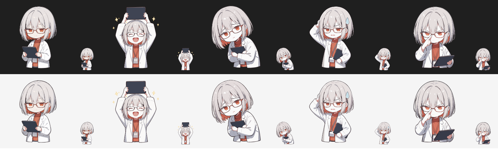

# ClaudeDesktopPet

Claude Desktop の Code タブで、入力欄の上に、相棒キャラ「倉戸あい（くらと あい）」のちびキャラを出す mod です。Claude の返答の最後のひとことを吹き出しに出し、作業中や返答の中身に合わせて表情とポーズを切り替えます。



左から、ふつう、うれしい、心配、困った、真剣。上は暗い背景、下は明るい背景で、それぞれ大きめの表示と帯と同じ 72px の表示を並べています。

## できること

- Claude Desktop の Code タブで、入力欄の上の帯にちびキャラと吹き出しを出す
- 作業中は真剣な顔にして、吹き出しに「書いてます…」「調べてます…」など、使っているツールに合わせた一言を出す
- 返答が終わったら、最後の段落を吹き出しに出し、その中の言葉で表情を選ぶ
  - 「よかった」「通りました」など → うれしい
  - 「休んで」「疲れ」など → 心配
  - 「すみません」「エラー」など → 困った
- ターミナル版の Claude Code では SVG を描けないので、名前と一言だけを出す

## 使い方

1. このリポジトリを好きな場所に clone する
2. `mod/kurato-ai/hooks/register.tsx` の `USER_NAME` に、呼んでほしい名前を入れる（空のままなら呼びかけなしの挨拶になる）
3. `~/.claude/settings.json` の `env` に、mod のフォルダを書く

   ```json
   {
     "env": {
       "CLAUDE_CODE_PLUGIN_DIRS": "C:/path/to/ClaudeDesktopPet/mod/kurato-ai",
       "CLAUDE_CODE_PLUGIN_DIR_WATCH": "1"
     }
   }
   ```

   `CLAUDE_CODE_PLUGIN_DIR_WATCH` は、mod のファイルを直したときに読み込み直すための設定です。

4. Claude Desktop の Code タブで、**新しい session を開く**

session の途中で mod を読み込んでも、Desktop には表示されないことがあります。詳しくは [docs/making-of.md](docs/making-of.md) の「つまずいたところ」を見てください。

吹き出しを活かすには、Claude 側に「返答の最後に短いひとことを置く」話し方をしてもらう必要があります。`~/.claude/CLAUDE.md` に書く例を [examples/CLAUDE.md-snippet.md](examples/CLAUDE.md-snippet.md) に置いています。

## 自分のキャラに差し替える

1. 表情ごとの絵を SVG で用意する（作り方は [docs/making-of.md](docs/making-of.md)）
2. `tools/optimize-svg.mjs` で、1枚 131,072 文字以内に縮める

   ```sh
   node tools/optimize-svg.mjs in.svg assets/svg/happy.svg
   ```

3. `assets/svg/` に `normal.svg` `happy.svg` `worried.svg` `troubled.svg` `serious.svg` を置いて、`hooks/chibi.ts` を作り直す

   ```sh
   node tools/build-chibi.mjs
   ```

## 確認

```sh
claude plugin validate mod/kurato-ai
claude plugin test mod/kurato-ai
```

## フォルダの中身

| パス | 中身 |
|---|---|
| `mod/kurato-ai/` | mod 本体。`hooks/register.tsx` が描画とイベント処理、`hooks/chibi.ts` が埋め込んだ SVG |
| `assets/svg/` | 表情ごとの SVG（縮めたあとのもの） |
| `tools/optimize-svg.mjs` | SVG を Claude Code の上限に収まるよう縮める |
| `tools/build-chibi.mjs` | `assets/svg/` から `hooks/chibi.ts` を作る |
| `docs/making-of.md` | キャラ作りから mod の完成までの手順とつまずいたところ |
| `examples/CLAUDE.md-snippet.md` | キャラの話し方を CLAUDE.md に書く例 |

## ライセンス

コード（`mod/` と `tools/`）は MIT です。キャラの絵（`assets/` と `hooks/chibi.ts` の中の SVG）は Magnific で生成したもので、ライセンスの対象外です。自分の mod を作るときは、絵を差し替えて使ってください。
